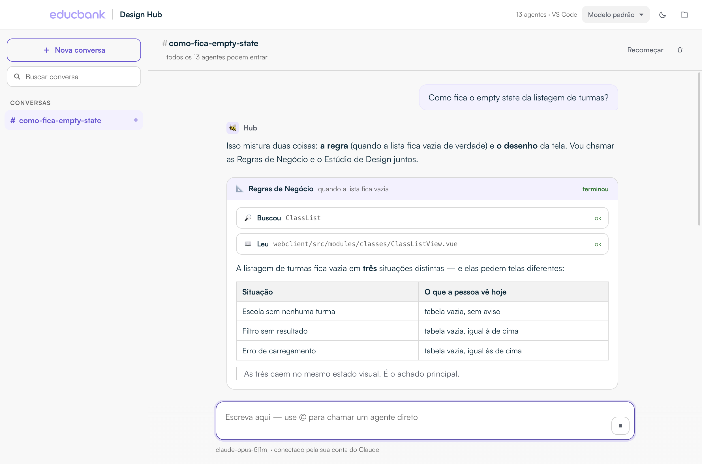
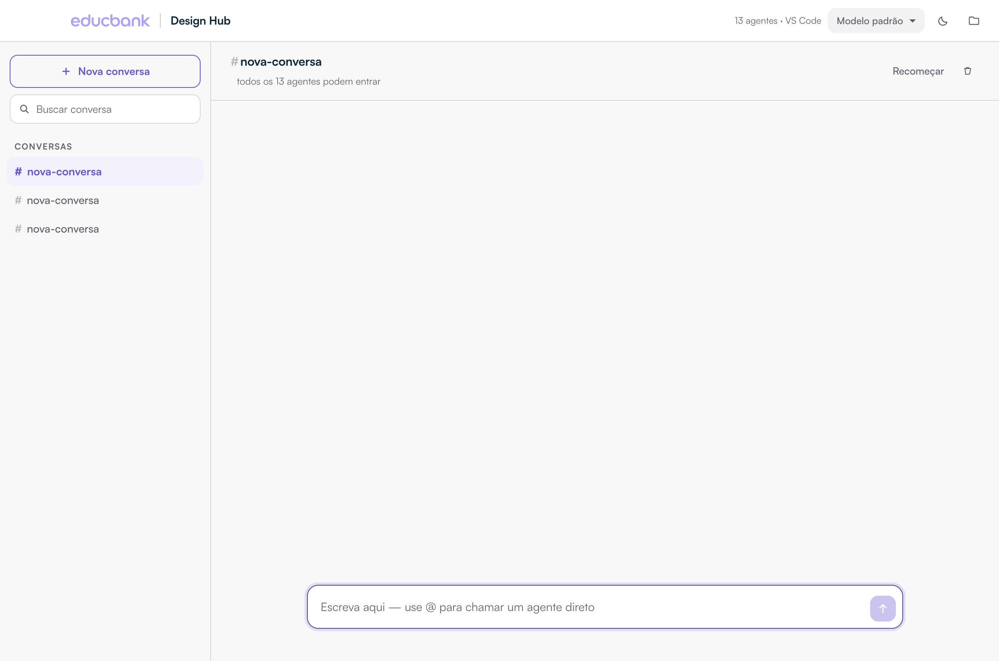
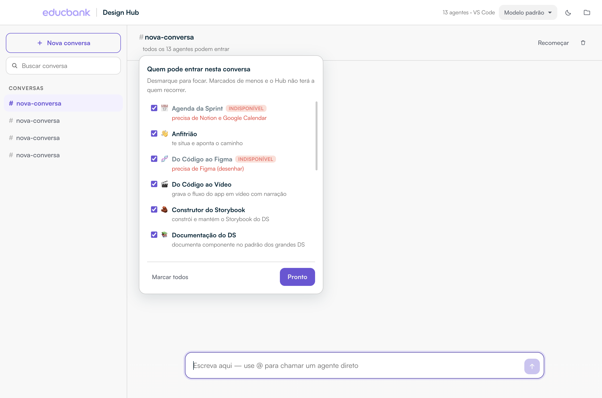
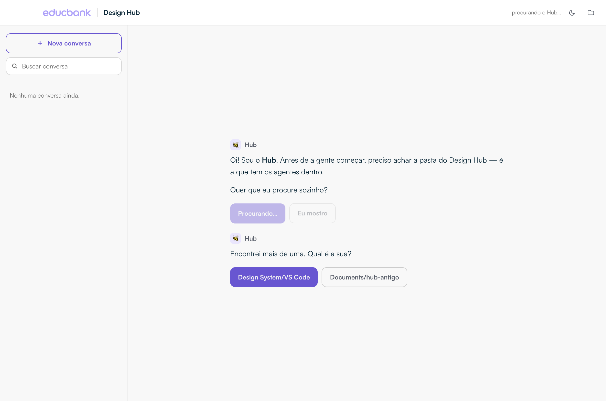
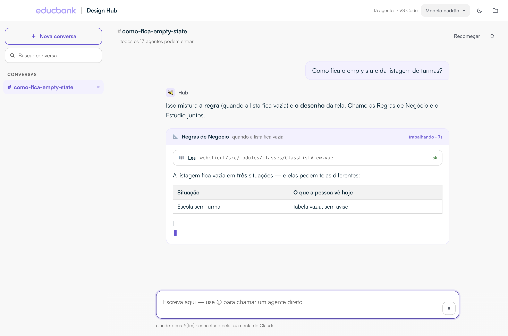

# Design Hub

Um chat. Treze agentes. Você não escolhe com quem falar — descreve o que precisa,
e os agentes entram na conversa quando o assunto é deles.



Não é um Claude Code paralelo: é **o mesmo motor**, com uma casca feita para
designer. Os agentes não são reimplementados aqui — o app aponta para a pasta do
Hub e lê `.claude/agents/`, `.claude/skills/`, `CLAUDE.md` e `memoria/` de lá. O
que você melhorar no Hub aparece no app na próxima mensagem.

## O modelo mental

**Uma conversa é um assunto, não um agente.** Você cria `#matricula-em-lote` ou
`#cores-do-ds` do mesmo jeito que criaria um canal — e os treze agentes são
membros que podem entrar em qualquer uma.

Quem atende é o **Hub**. Ele lê o pedido, diz em uma linha quem vai chamar e por
quê, e aciona os agentes que fizerem sentido — às vezes dois de uma vez, quando
o pedido mistura, digamos, a regra do sistema e o desenho da tela. Cada agente
aparece num bloco próprio, com o que ele leu e o que ele concluiu à vista. No
fim, o Hub fecha com uma síntese.

Se você quiser mandar direto, escreva **@** e o nome: `@regras o que acontece
se…`. Menção manda — o agente citado entra na certa.

## O que funciona aqui, e o que não

Os conectores da **claude.ai** (Figma oficial, Notion, Calendar, Slack…) vivem na
sessão do navegador: eles aparecem na lista de servidores, param em
`pending`/`needs-auth` e **nunca entregam ferramenta ao modelo** dentro do app.
O que funciona é **servidor MCP local**, e o app sobe um sozinho.

Hoje: **9 dos 13 agentes prontos, 2 bloqueados, 2 limitados.**

| | |
|---|---|
| **Prontos** | Regras · Documentação do DS · Storybook · Vídeo · Relatório · Publicador · Anfitrião · **Figma→Código** · **Mapa do DS** |
| **Bloqueados** | Código→Figma *(desenhar no Figma só pelo conector oficial)* · Agenda da Sprint *(Notion + Calendar)* |
| **Limitados** | Estúdio *(sem Mobbin)* · Regras *(sem Notion)* |

**O Figma o app liga sozinho.** Se existir um token em `~/.config/ebp/figma_token`,
ele sobe o `figma-developer-mcp` e passa a credencial pelo ambiente do processo
filho — o segredo nunca toca o disco do Hub, que é um repositório git.

O app **conta tudo isso na cara**: chips na tela de entrada, selo no painel de
membros com o motivo, aviso antes de gastar o turno se você chamar um bloqueado,
e a vitrine de boas-vindas filtrada por quem realmente funciona.

## O que ele faz

- **Conversas com histórico**, salvas no seu computador. Fecha o app, abre
  depois, tudo está lá. A primeira mensagem batiza a conversa.
- **Nada de tela de setup.** Se faltar alguma coisa, quem fala é o Hub, no chat:
  ele procura a pasta sozinho, pergunta qual é se achar mais de uma, e **baixa o
  Hub** se você ainda não tiver.
- **Se atualiza sozinho** ao abrir (`git pull --ff-only`) e anuncia agente novo
  na conversa. Não puxa nada se você tiver trabalho não salvo.
- **Os agentes falam enquanto trabalham**, token a token, com relógio de tempo
  decorrido — em vez de ficarem mudos até terminar.
- **Os agentes trabalhando à vista**: cada arquivo lido, busca feita ou comando
  rodado vira um cartão clicável dentro do bloco do agente.
- **Membros por conversa**: todas nascem com os treze liberados. Se quiser focar,
  desmarque no cabeçalho — `#auditoria-de-cor` pode ter só Regras e Documentação.
- **Troca de modelo** pelo seletor no topo, por conversa.
- **Resposta em tempo real**, com markdown (tabela, lista, código, citação).
- **Tema claro e escuro**, nos tokens do Design System.

| | |
|---|---|
|  |  |
|  |  |

## Segurança

O app é **read-only por padrão**. Ler arquivo, buscar e listar acontecem
sozinhos. Qualquer coisa que **escreve, roda comando ou sai para a internet**
para e pede autorização na tela, mostrando exatamente o que vai fazer — e dizendo
qual agente pediu. Se você negar, a conversa segue sem aquilo.

A regra vive em `main.js`, na constante `SEM_PERGUNTAR` — é a lista fechada do
que dispensa aprovação.

## Rodar no seu Mac (desenvolvimento)

```bash
cd design-hub
npm install
npm start
```

Na primeira vez, se o app não achar o Hub sozinho, clique no ícone de pasta no
canto superior direito e aponte para a pasta que contém `.claude/` e `CLAUDE.md`.

## Gerar o aplicativo para instalar

```bash
npm run distribuir
```

Sai um `dist/Design Hub-0.1.0-arm64.dmg` (~185 MB). É esse arquivo que você
manda para alguém testar.

Para Macs Intel: `npx electron-builder --mac --arm64 --x64`.

## Compartilhar com outra pessoa

**Duas coisas precisam estar resolvidas na máquina dela** — sem elas o app abre
mas não responde:

**1 · Ela precisa estar logada no Claude.** O app usa a mesma credencial do
Claude Code, guardada no Keychain do macOS. Se ela nunca usou o Claude Code,
precisa instalar e fazer login uma vez:

```bash
npm install -g @anthropic-ai/claude-code
claude          # abre o navegador para o login; depois é só sair com Ctrl+C
```

Feito isso, ela nunca mais precisa abrir o terminal.

**2 · Uma cópia do Hub na máquina** — mas isso o app resolve: na primeira
abertura ele procura, e se não achar, oferece **baixar sozinho**. Só precisa que
a pessoa tenha acesso ao repositório no GitHub.

### O aviso do macOS ao abrir

O app **não é assinado** com uma conta de desenvolvedor Apple (US$ 99/ano). Na
primeira abertura o macOS vai dizer que não confia nele:

1. Arraste o **Design Hub** do DMG para a pasta Aplicativos.
2. **Clique com o botão direito** no app → **Abrir** → **Abrir** de novo no
   aviso. (Clique duplo simples não oferece a opção — tem que ser pelo menu.)
3. Só na primeira vez.

Se mesmo assim não abrir:

```bash
xattr -dr com.apple.quarantine "/Applications/Design Hub.app"
```

## Como está montado

```
main.js            processo principal: conversa com o Claude Agent SDK, guarda
                   as conversas em disco e é o portão das permissões
preload.js         a única ponte entre a interface e o main
renderer/
  index.html       estrutura (tela de entrada + tela de conversa)
  estilo.css       os 70 tokens do DS (claro + escuro) e o layout
  app.js           o fio como DADOS, streaming, blocos de agente, menções
  marcacao.js      markdown → HTML, escapando tudo antes
assets/            logo do Educbank + a família Satoshi
```

O renderer não tem Node, não tem filesystem e não tem SDK — só fala com
`window.hub`, definido no `preload.js`. O fio da conversa é modelado como um
array de itens, não como DOM: é isso que permite salvar e reabrir.

As conversas ficam em `~/Library/Application Support/Design Hub/`
(`conversas.json` + um arquivo por fio).

## Limites conhecidos

- **É local.** Cada pessoa roda na própria máquina, com o próprio clone e a
  própria conta. **Não dá para colocar outra pessoa na mesma conversa** — isso
  exigiria servidor, login e histórico compartilhado. Agentes são membros;
  colegas, ainda não.
- **Uma conversa trabalha por vez.** Você pode abrir outra e usar em paralelo.
- **A restrição de membros é uma instrução, não uma trava técnica.** O Hub é
  orientado a não acionar quem está desmarcado, e obedece — mas não há um muro
  impedindo.
- **O login ainda passa pelo terminal, uma vez.** O SDK tem OAuth embutido mas
  não expõe API pública para dispará-lo — forçar internals quebraria na próxima
  versão. O clone, esse sim, o app já faz sozinho.
- **Só macOS Apple Silicon** no build atual.
- **Custo estimado** é o número que o Claude reporta; em conta por assinatura é
  referência, não cobrança.
